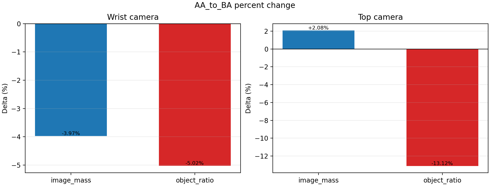
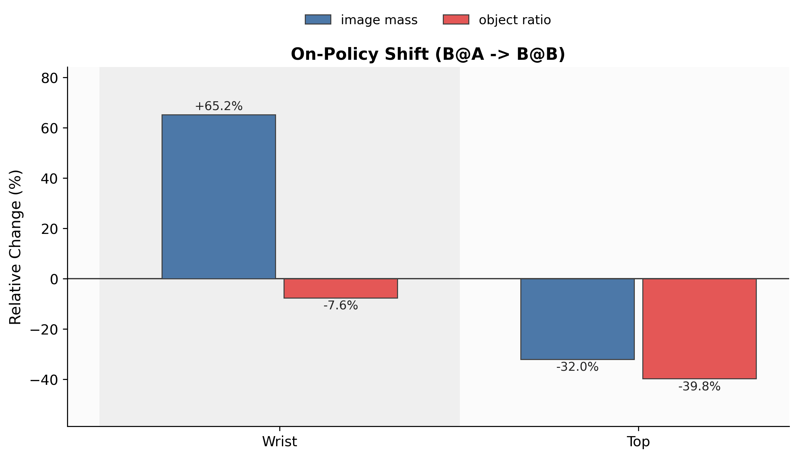
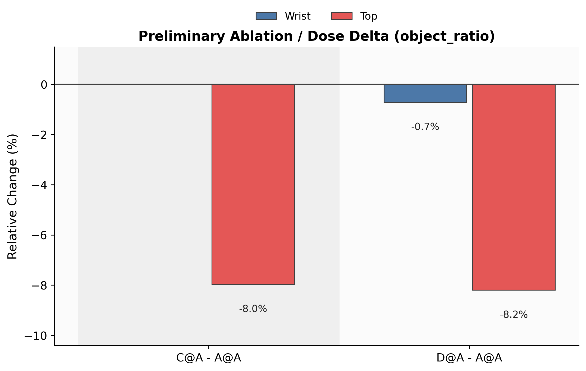
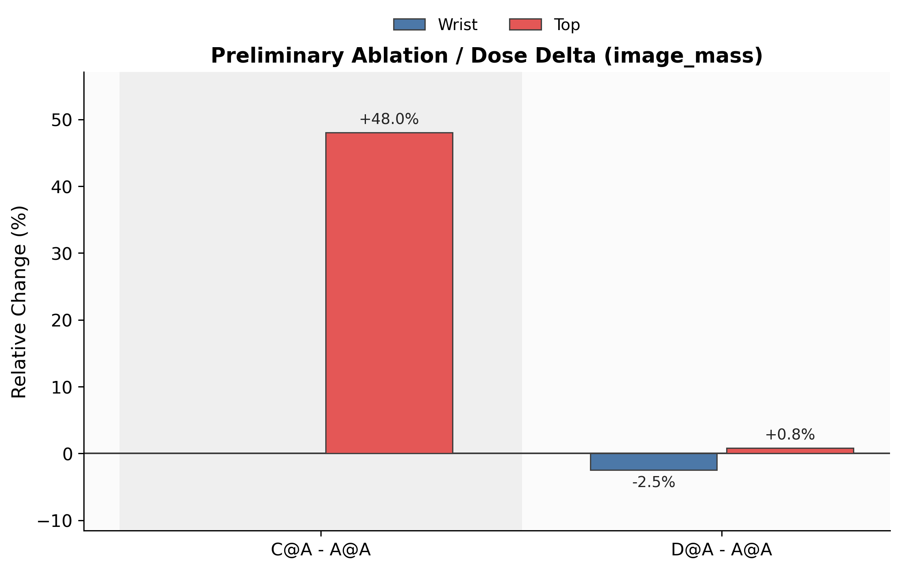
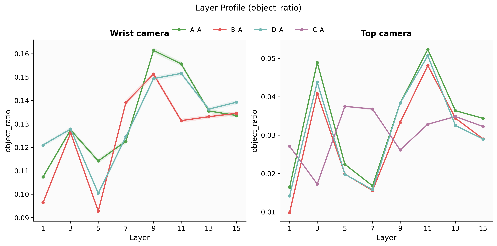
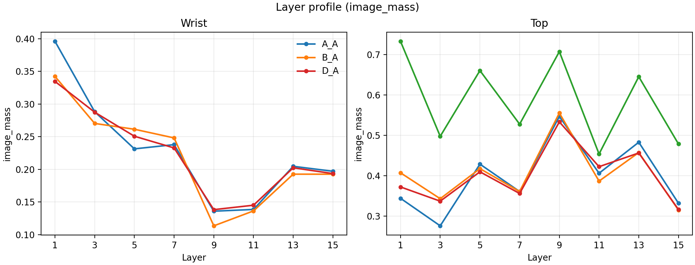
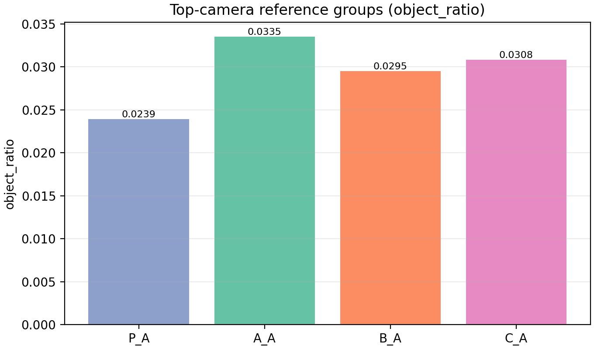
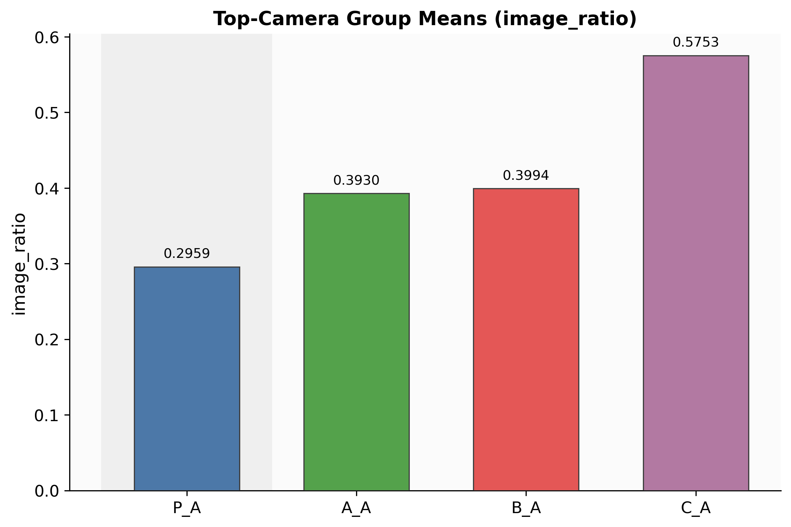

# Results Tables And Figures (Insert-Ready)

이 문서는 본문에 바로 옮겨 붙일 수 있도록 핵심 표와 그림 해석을 순서대로 정리한 파일이다.

## Table 1. H1 fixed-frame effect (A@A -> B@A)
| Camera | A@A image_mass | B@A image_mass | Δ image_mass | A@A object_ratio | B@A object_ratio | Δ object_ratio |
| --- | --- | --- | --- | --- | --- | --- |
| camera1 | 0.2287 | 0.2196 | -3.97% | 0.1322 | 0.1256 | -5.02% |
| camera2 | 0.3973 | 0.4056 | +2.08% | 0.0332 | 0.0289 | -13.12% |

해석: 프레임을 고정해도 object_ratio가 camera1/camera2 모두 하락한다.

## Table 2. H2 on-policy shift (B@A -> B@B)
| Camera | B@A image_mass | B@B image_mass | Δ image_mass | B@A object_ratio | B@B object_ratio | Δ object_ratio |
| --- | --- | --- | --- | --- | --- | --- |
| camera1 | 0.2196 | 0.3629 | +65.24% | 0.1256 | 0.1160 | -7.62% |
| camera2 | 0.4056 | 0.2756 | -32.03% | 0.0289 | 0.0174 | -39.77% |

해석: image_mass는 wrist(camera1)로 재분배되고(top 하락), object_ratio는 추가 하락한다.

## Table 3. H3/H4 preliminary (A@A -> C@A, D@A)
| Comparison | Camera | Base image_mass | Target image_mass | Δ image_mass | Base object_ratio | Target object_ratio | Δ object_ratio |
| --- | --- | --- | --- | --- | --- | --- | --- |
| A_A -> C_A | camera2 | 0.3973 | 0.5880 | +48.01% | 0.0332 | 0.0306 | -7.97% |
| A_A -> D_A | camera1 | 0.2287 | 0.2231 | -2.45% | 0.1322 | 0.1313 | -0.72% |
| A_A -> D_A | camera2 | 0.3973 | 0.4006 | +0.82% | 0.0332 | 0.0305 | -8.19% |

해석: C/D 조건은 현재 preliminary이며, 결론 확정 전 재검증이 필요하다.

## Table 4. Top-camera transition matrix (P@A, A@A, B@A, C@A)
| Metric | P@A | A@A | B@A | C@A | AA/PA | BA/AA | CA/BA |
| --- | --- | --- | --- | --- | --- | --- | --- |
| image_mass | 0.2959 | 0.3930 | 0.3994 | 0.5753 | +32.82% | +1.62% | +44.05% |
| object_ratio | 0.0239 | 0.0335 | 0.0295 | 0.0308 | +40.24% | -11.90% | +4.43% |

## Table 5. Outcome matrix (top-camera)
| Metric | Outcome | P@A | A@A | B@A | B@B | AA/PA | BA/AA | BB/BA |
| --- | --- | --- | --- | --- | --- | --- | --- | --- |
| image_mass | 1 | 0.2948 | 0.3850 | 0.3876 | 0.2895 | +30.56% | +0.68% | -25.31% |
| image_mass | 2 | 0.2954 | 0.3992 | 0.4093 | 0.2695 | +35.15% | +2.53% | -34.17% |
| image_mass | 3 | 0.3021 | 0.3969 | 0.4015 | 0.2680 | +31.39% | +1.17% | -33.24% |
| object_ratio | 1 | 0.0329 | 0.0460 | 0.0418 | 0.1057 | +39.62% | -9.17% | +153.00% |
| object_ratio | 2 | 0.0162 | 0.0225 | 0.0195 | 0.0855 | +38.45% | -13.14% | +338.03% |
| object_ratio | 3 | 0.0222 | 0.0332 | 0.0255 | 0.0776 | +49.64% | -22.95% | +203.74% |

주의: B@B outcome 분해는 별도 요약 소스 기반이므로 exploratory 성격으로 사용.

## Figures
- `G1_fixed_frame_AA_to_BA_pct.png`: H1 핵심: 고정 A 프레임에서 A@A 대비 B@A의 camera별 변화율
  
- `G2_onpolicy_BA_to_BB_pct.png`: H2 핵심: B@A 대비 B@B on-policy 변화율
  
- `G3_prelim_ablation_object_ratio.png`: H3 예비: A@A 대비 C@A/D@A object_ratio 변화
  
- `G4_prelim_dose_image_mass.png`: H4 예비: A@A 대비 C@A/D@A image_mass 변화(용량 효과 점검)
  
- `G5_layer_profile_object_ratio_abcd.png`: 부록: A/B/C/D layer별 object_ratio 프로파일
  
- `G6_layer_profile_image_mass_abcd.png`: 부록: A/B/C/D layer별 image_mass 프로파일
  
- `G7_topcam_object_ratio_groups.png`: Top-camera 그룹 평균 object_ratio (P/A/B/C)
  
- `G8_topcam_image_ratio_groups.png`: Top-camera 그룹 평균 image_ratio (P/A/B/C)
  